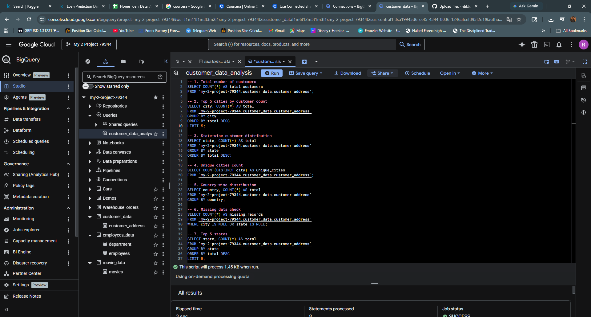

# Customer Data Analysis using BigQuery

##  Objective
The objective of this project is to analyze customer address data to understand geographic distribution and data quality.

## Tools Used
- Google BigQuery
- SQL

## Analysis Performed
- Total number of customers
- Top cities with highest customers
- State-wise distribution
- Unique cities count
- Country-wise distribution
- Missing data identification

##  Key Insights
- A significant number of customers are concentrated in a few top cities.
- Customer distribution varies across different states.
- The dataset contains minimal missing values, indicating good data quality.
- Most records have complete city and state information.

##  Conclusion
This analysis helps in understanding customer distribution patterns and ensures data quality for better business decision-making.
## Sample Output

